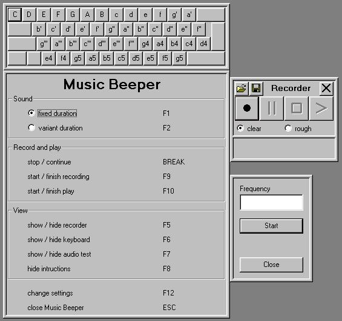



## Music Beeper

### Description

Enables the keyboard to be used as a simple intrument by using the beeper. Played pieces can be recorded and played back. Includes also a test for your ears. Can be used in English and in German.
 
### More Info
 
Needs Windows NT 3.1 or higher, doesn't run with W95/98 (because these OS don't support the beep-function).

             |
---                |---
**Submitted On**   |2004-07-21 14:06:10
**By**             |[Markus Bögel](https://github.com/Planet-Source-Code/PSCIndex/blob/master/ByAuthor/markus-b-gel.md)
**Level**          |Intermediate
**User Rating**    |5.0 (15 globes from 3 users)
**Compatibility**  |VB 6\.0
**Category**       |[Complete Applications](https://github.com/Planet-Source-Code/PSCIndex/blob/master/ByCategory/complete-applications__1-27.md)
**World**          |[Visual Basic](https://github.com/Planet-Source-Code/PSCIndex/blob/master/ByWorld/visual-basic.md)
**Archive File**   |[Music\_Beep1773537242004\.zip](https://github.com/Planet-Source-Code/markus-b-gel-music-beeper__1-55049/archive/master.zip)

